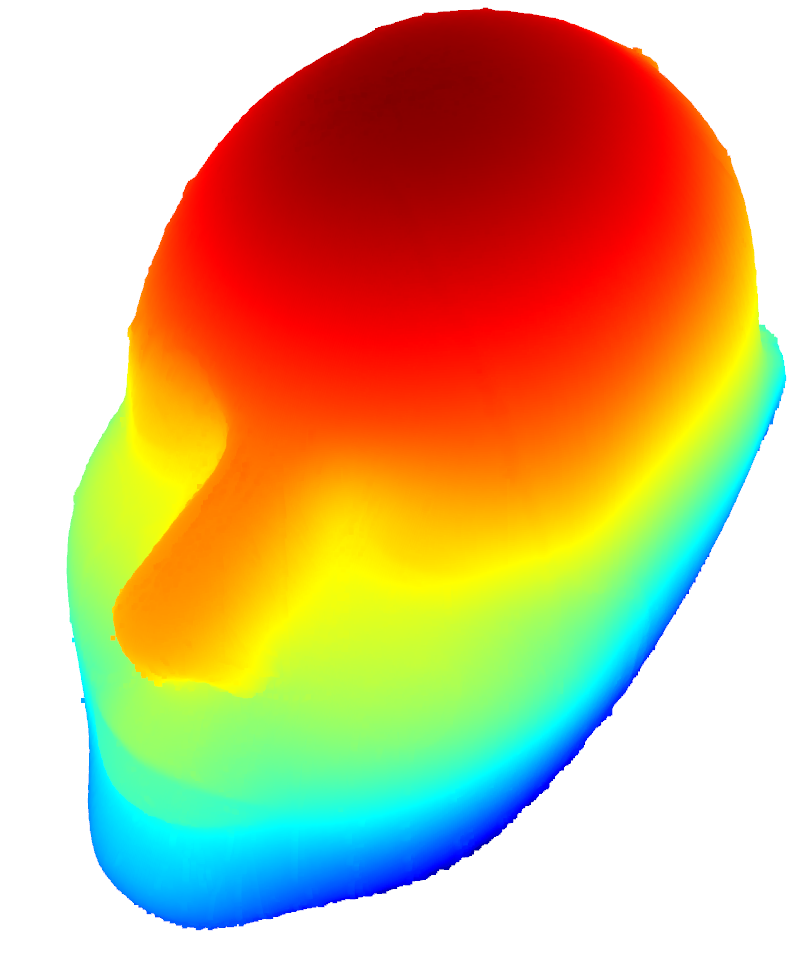

# TAMS head mesh

## Calibration board

|||
|:----------:|:----------:|
|**standalone tags**|**bundle tag**|

## Covert multi-view camera shots to a complete point cloud
- `roslaunch tams_360_scan single_image_server.launch`
- prepare data and put the `*.pickle` to `data/shot_1/` (the pickle file contain png and depth as a dict)
- `rosrun tams_360_scan convert_mesh.py`

|||
|:----------:|:----------:|
|**Result 1**|**Result 2**|

|||
|:----------:|:----------:|
|**Remove outlier**|**Normal estimation**|
