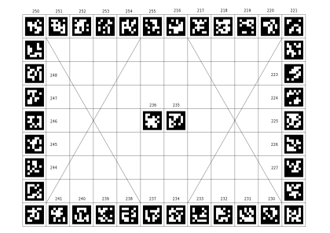

# TAMS head mesh

## Calibration board

|||
|:----------:|:----------:|
|**standalone tags**|**bundle tag**|

## Covert multi-view camera shots to a complete point cloud
- `roslaunch tams_head_mesh single_image_server.launch`
- `rosrun tams_head_mesh convert_mesh2.py` (need pickle file that contain png and depth as a dict)
- Result 1:

- Result 2:

