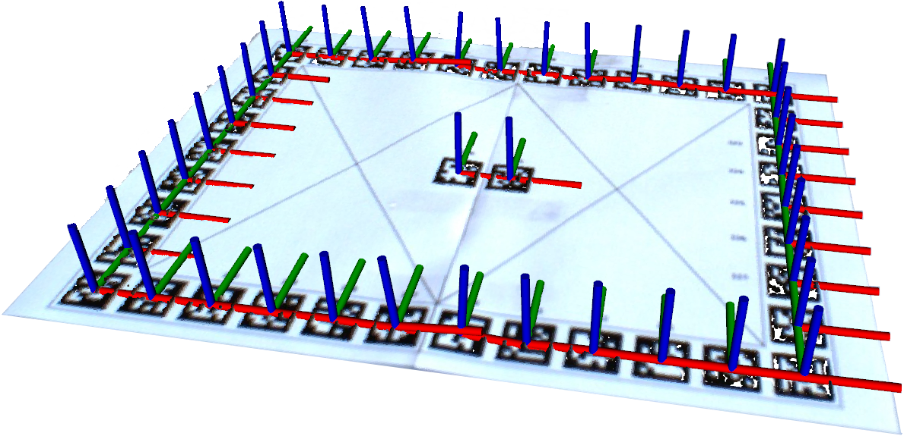
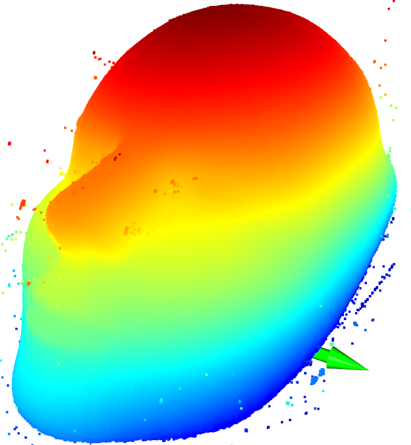

# TAMS 360 Scan

## Calibration board

|||
|:----------:|:----------:|
|**standalone tags**|**bundle tag**|

## Pre-requests
Put the following packges into the same ROS workspace as the current `tams_360_sacan` package and compile using `catkin build`:
- apriltag: https://github.com/AprilRobotics/apriltag.git
- apriltag_ros: https://github.com/AprilRobotics/apriltag_ros.git

## Take shots
- put the object you want to scan on the center of calibration board.
- take shots using whatever tools you like at different angles, you should rotate the calibration board together with the object, and put the rgb and depth image for the same shooting angle to a python dict and save it as a `pickle` file.
- prepare data and put the `*.pickle` to `data/shot_1/` (the pickle file contain png and depth as a dict)

## Covert multi-view camera shots to a complete point cloud
- Open one terminal, and run: `roslaunch tams_360_scan single_image_server.launch model_type:=head`
- Specify the camera info you use, here is an example we use: https://github.com/TAMS-Group/tams_camera_config/blob/master/mechmind_camera/camera_info.yaml

## Example result:
||
|:----------:|
|**Result**|

|||
|:----------:|:----------:|
|**Remove outlier**|**Normal estimation**|
